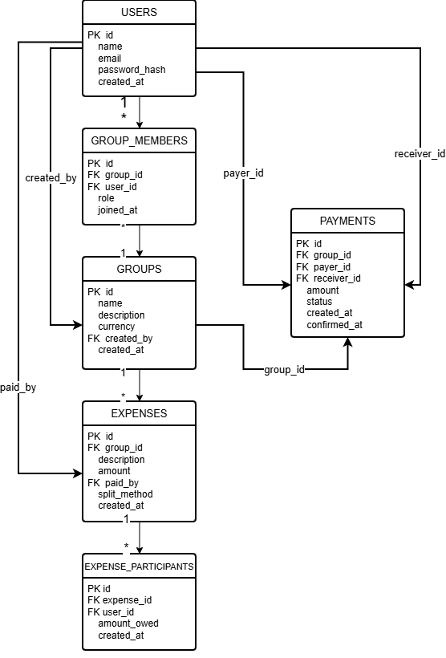

# SplitMate

SplitMate is a group expense management application designed to
simplify tracking shared expenses and repayments between friends.

## Problem

When a large group participates in an activity, one person may pay
for everyone. Tracking who owes what through WhatsApp messages,
notes or spreadsheets can become difficult.

## Solution

SplitMate maintains a centralised expense ledger that calculates
individual balances and provides an optimised settlement plan.

## Planned Features

- User accounts
- Groups
- Group invitations
- Shared expenses
- Equal and unequal splitting
- Balance calculation
- Payment tracking
- Settlement optimisation
- Notifications

## Planned Technology

Frontend:
Next.js / React / TypeScript

Backend:
Python / FastAPI

Database:
PostgreSQL

Deployment:
Docker / Cloud infrastructure

CI/CD:
GitHub Actions

## System Architecture

The following diagram illustrates the planned architecture of SplitMate
and the communication between the frontend, backend and database.

See the full system architecture documentation:
[Architecture Design](docs/architecture.md)

## Database Design

SplitMate uses PostgreSQL to store users, groups, expenses,
participants and repayments.

The database follows a relational structure with foreign keys
used to maintain relationships between users, groups and expenses.

See the full database design documentation:
[Database Design](docs/database-design.md)

