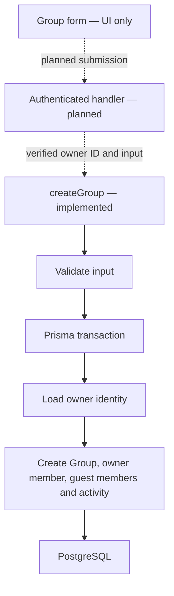
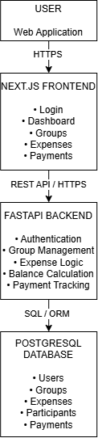

# SplitMate System Architecture

## Implementation and testing notes — 17 September 2026

These notes were added during implementation and testing to describe the architecture actually present in the repository. The original FastAPI proposal and image remain below as historical design notes.

### Implemented components

| Component | Current implementation |
| --- | --- |
| Web application | Next.js App Router with React, TypeScript and Tailwind CSS |
| Pages | Landing page, static dashboard and static group-creation form |
| Backend service | Server-only `createGroup` in `src/data/groups.ts` |
| Database client | Module-level Prisma 8 PostgreSQL client in `src/prisma/db.ts` |
| Contract | Authored `contract.prisma` with generated JSON and TypeScript artifacts |
| Storage | Prisma-hosted PostgreSQL; application client reads `DATABASE_URL` |

The current backend is part of the Next.js application. No Python/FastAPI backend, registration route, owner-session utility or public group-creation endpoint exists in the inspected repository.

### Group-creation boundary

The service uses `tx.orm.public` for every database operation in the transaction. An error escapes the callback so Prisma can roll back all writes. It returns a minimal group summary after successful completion.

### Identity and access

- A registered User creates a group and also receives an OWNER GroupMember.
- Guest GroupMembers can exist without User accounts.
- The caller must resolve the owner from a verified session. User existence alone is not authentication.
- A cryptographically random share token is generated by the service. Resolving shared links and claiming member identities are future work.
- GuestSession storage exists in the contract; its cookie/session behaviour is not implemented yet.

### Testing boundary

The unit tests replace the database module with a transaction double. They exercise the service's validation and failure paths without loading cloud credentials. Type checking uses the installed Prisma contract types. Live database integration and authenticated request behaviour remain unverified.

See [group creation](group-creation.md) for inputs and errors, and [the progress report](progress-report.md) for the checks performed.

---

## Original notes — preserved

The following notes are retained as originally written. For current implementation status, use the dated update above.

## Overview

SplitMate will use a client-server architecture consisting of a web frontend, REST API backend and relational PostgreSQL database.

The frontend will be responsible for presenting the user interface and communicating with the backend through HTTPS requests.

The backend will contain the application's business logic, including expense calculations, balance calculations, group management and payment tracking.

PostgreSQL will provide persistent storage for users, groups, expenses and payments.

## Planned Architecture

The main components are:

* **Frontend:** Next.js, React and TypeScript
* **Backend:** Python and FastAPI
* **Database:** PostgreSQL
* **API:** RESTful API
* **Version Control:** Git and GitHub

## Data Flow

When a user creates an expense, the frontend sends the expense information to the FastAPI backend through the REST API.

The backend validates the request, calculates the relevant participant shares and stores the expense and participant information in PostgreSQL.

When the user views their group balance, the backend retrieves the relevant expenses and payments and calculates their current net balance.

## Design Considerations

A relational database was selected because SplitMate contains several strongly related entities, including users, groups, expenses, participants and payments.

The application will separate presentation, business logic and data storage to make the system easier to maintain, test and extend.
