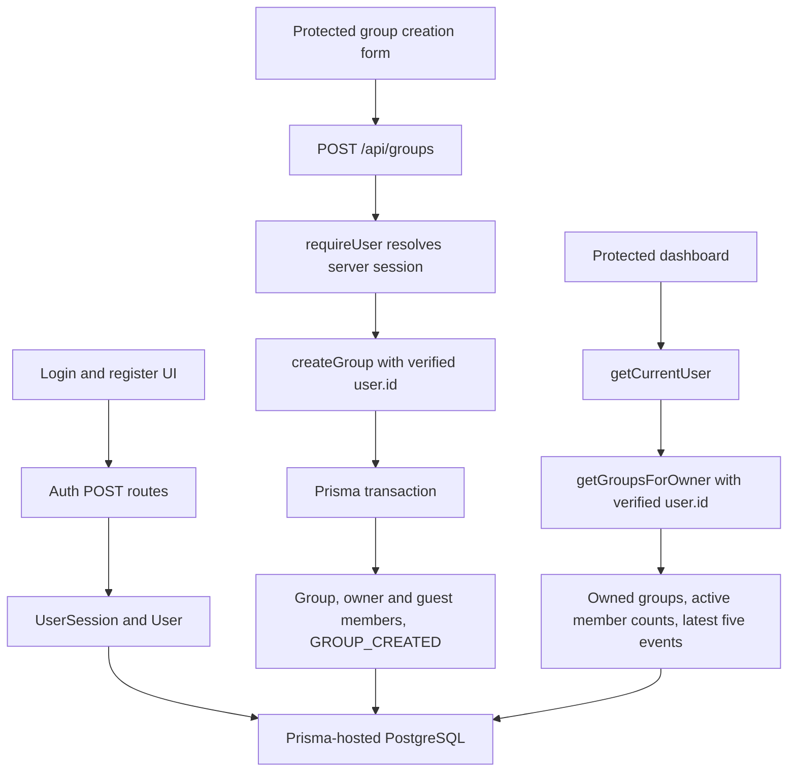

# SPLITMate Architecture

## Implementation and testing update - 19 September 2026

This section records the current implementation and its testing results. Original notes are preserved separately below as historical material; their older plans and status statements are not current behaviour.

### Completed

The application uses Next.js App Router, React, TypeScript and Tailwind CSS. Route handlers, server-only services and Prisma 8 RC run within the Next.js application; there is no separate FastAPI backend. Persistence uses Prisma-hosted PostgreSQL through `src/prisma/db.ts`.

### Authentication and identity boundaries

- Owner session tokens use 32 random bytes; only their SHA-256 hashes are stored in `UserSession`.
- Host-only HttpOnly cookies use SameSite=Lax and no Domain. HTTPS uses the `__Host-` cookie; local HTTP development uses a separate cookie name. Sessions expire after eight hours.
- Passwords use bcrypt cost 12. Registration requires at least 15 characters and at most 72 UTF-8 bytes. Emails are trimmed and lowercased; passwords are not trimmed.
- Registration does not issue a session. Login failures remain generic. Logout is POST-only and revokes the database session before expiring the cookie.
- Same-origin checks protect mutation endpoints. Guards live directly in the owner pages, leaving future guest routes publicly reachable.
- Post-login destinations are restricted to `/dashboard` and `/groups/new`; login performs a fresh navigation.
- User accounts and GroupMember identities stay separate. Financial references use GroupMember; guest sessions remain separate from owner sessions.

### Dashboard reads

`getGroupsForOwner` validates the owner ID and selects only dashboard fields from groups where `createdBy` equals the verified User ID. Prisma's filtered `members` relation reducer counts active GroupMembers, including guests. A second query fetches the latest five events across those group IDs. An owner with no groups needs only one query. Both lists order by creation timestamp and ID descending.

There is no per-group query loop. The read service returns no share tokens, password hashes or session data. No cross-user application cache is introduced. Since Group has no archive flag, the displayed active-group count means all owned groups.

### Next

Owner group details, dashboard card navigation and group members/activity, then share-link controls, public token access and guest claiming. See the [ordered roadmap](dev-roadmap.md).

### Future

Expenses, balances and repayments follow guest access. Account linking remains optional. Add rate limiting before public deployment. Group submission has a pending state but no server-side idempotency guarantee.

### Verification

Local tests cover authentication, page guards, dashboard reads and creation. A live creation request and a read-only dashboard query have succeeded against the cloud database. Mocked transaction tests do not independently prove live PostgreSQL rollback. See [progress](progress-report.md).

---

Historical original notes - not current implementation

## Original notes — preserved

The following notes are retained as originally written. For current implementation status, use the dated update above.

## Overview

SplitMate will use a client-server architecture consisting of a web frontend, REST API backend and relational PostgreSQL database.

The frontend will be responsible for presenting the user interface and communicating with the backend through HTTPS requests.

The backend will contain the application's business logic, including expense calculations, balance calculations, group management and payment tracking.

PostgreSQL will provide persistent storage for users, groups, expenses and payments.

## Planned Architecture

The main components are:

* **Frontend:** Next.js, React and TypeScript
* **Backend:** Python and FastAPI
* **Database:** PostgreSQL
* **API:** RESTful API
* **Version Control:** Git and GitHub

## Data Flow

When a user creates an expense, the frontend sends the expense information to the FastAPI backend through the REST API.

The backend validates the request, calculates the relevant participant shares and stores the expense and participant information in PostgreSQL.

When the user views their group balance, the backend retrieves the relevant expenses and payments and calculates their current net balance.

## Design Considerations

A relational database was selected because SplitMate contains several strongly related entities, including users, groups, expenses, participants and payments.

The application will separate presentation, business logic and data storage to make the system easier to maintain, test and extend.

