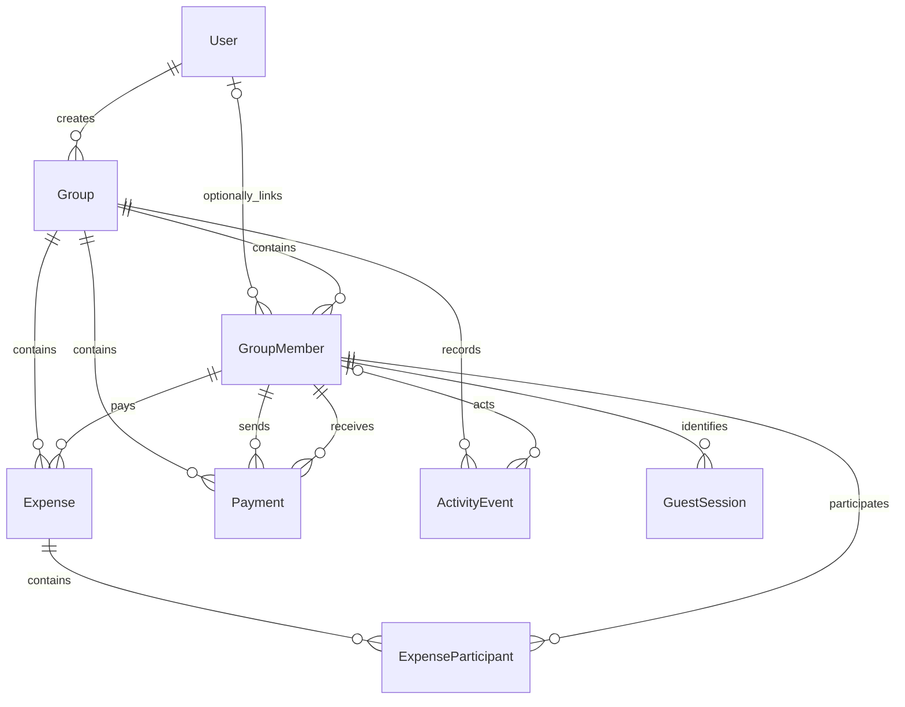

# Database Design

## Implementation and testing notes — 17 September 2026

This section was added during implementation and testing after inspecting [the current Prisma contract](../src/prisma/contract.prisma). It supersedes the original six-table, User-based financial design preserved below. The original ERD image is historical.

### Current contract

There are eight models. Primary keys are auto-incrementing integers. Timestamp fields use `TimestamptzString`, and monetary fields use `Decimal`.

| Model | Current fields and relationships |
| --- | --- |
| User | `id`, `name`, unique `email`, `passwordHash`, `createdAt`; creates groups and optionally links to memberships |
| Group | `id`, `name`, nullable `description`, `currency`, `createdBy → User`, unique `shareToken`, `shareLinkEnabled`, `createdAt` |
| GroupMember | `id`, `groupId → Group`, nullable `userId → User`, `name`, `role`, nullable `claimedAt` and `lastActiveAt`, `isActive`, `addedAt` |
| Expense | `id`, `groupId → Group`, `description`, `amount`, `paidByMemberId → GroupMember`, `splitMethod`, `createdAt` |
| ExpenseParticipant | `id`, `expenseId → Expense`, `memberId → GroupMember`, `amountOwed`, `createdAt`; unique `(expenseId, memberId)` |
| Payment | `id`, `groupId → Group`, `payerMemberId` and `receiverMemberId → GroupMember`, `amount`, `status`, `createdAt`, nullable `sentAt` and `confirmedAt` |
| ActivityEvent | `id`, `groupId → Group`, nullable `memberId → GroupMember`, `eventType`, `description`, nullable `entityType` and `entityId`, `createdAt` |
| GuestSession | `id`, `groupMemberId → GroupMember`, unique `tokenHash`, `createdAt`, `lastSeenAt`, `expiresAt` |

A GroupMember is a group identity with an optional account link. All financial relationships use that identity, allowing guests to pay, participate and receive repayments without registering.



### Constraints and application rules

The contract declares uniqueness for User email, Group share token, GuestSession token hash and the ExpenseParticipant expense/member pair, in addition to primary keys. It does **not** declare unique member names or a unique `(groupId, userId)` pair.

The group-creation service enforces distinct normalized names within the submitted group and adds the owner once. It creates guests with null `userId` and `claimedAt`, and writes GROUP_CREATED with the owner's GroupMember as actor in the same transaction.

Roles, event types, split methods and payment statuses are stored as strings, not database enums. Future expense/payment handlers must enforce valid states, positive amounts, matching group membership and deterministic rounding. The contract's individual foreign keys do not enforce all same-group relationships. The intended payment lifecycle is SENT followed by receiver CONFIRMED; the workflow is not implemented yet.

ActivityEvent `entityType` and `entityId` are descriptive references, not a polymorphic database foreign key. The group-creation service writes `GROUP` and the newly created group ID.

### Migration and verification history

The repository contains:

1. `20260906T2009_initial_schema`
2. `20260913T2223_guest_members_and_activity`

Project records state that both were applied and that the second migration was verified against the cloud database. The current generated contract storage hash begins `e6e9161`. The backend implementation and this documentation update did not change the contract, migrations or cloud database.

The 32 backend unit tests use a database double. They verify transaction usage and propagated failures; they do not independently verify PostgreSQL constraints, live schema state or rollback.

Use `DATABASE_URL` for application traffic and the direct administrative connection when performing approved migration operations. Connection values remain private. Future schema changes require a new reviewed migration; applied migrations remain immutable.

---

## Original notes — preserved

The following notes are retained as originally written. For current implementation status, use the dated update above.


## Overview

SPLITMate uses a relational database to store users, groups, shared expenses, expense participants, and payments between users.

The database is designed so that:

- users can belong to multiple groups;
- groups can contain multiple users;
- expenses belong to a group and record who originally paid;
- each expense can be split between multiple participants;
- the amount owed by each participant can be stored individually;
- repayments between users can be recorded and tracked separately from expenses.

This structure keeps the data normalised and separates the original expense from the later payments used to settle balances.

---

## Entity Relationship Diagram


The ERD contains six main tables:

1. `USERS`
2. `GROUPS`
3. `GROUP_MEMBERS`
4. `EXPENSES`
5. `EXPENSE_PARTICIPANTS`
6. `PAYMENTS`

---

## Tables

### USERS

Stores account information for each SPLITMate user.

| Column | Type | Constraints | Description |
|---|---|---|---|
| `id` | Integer / UUID | Primary Key | Unique identifier for the user |
| `name` | String | Not Null | User's display name |
| `email` | String | Unique, Not Null | User's email address |
| `password_hash` | String | Not Null | Securely hashed password |
| `created_at` | Timestamp | Not Null | Date and time the account was created |

A user can create groups, join multiple groups, pay for expenses, participate in expenses, and send or receive payments.

---

### GROUPS

Stores information about each expense-sharing group.

| Column | Type | Constraints | Description |
|---|---|---|---|
| `id` | Integer / UUID | Primary Key | Unique identifier for the group |
| `name` | String | Not Null | Name of the group |
| `description` | String / Text | Nullable | Optional description of the group |
| `currency` | String | Not Null | Currency used by the group, such as GBP |
| `created_by` | Integer / UUID | Foreign Key → `USERS.id` | User who created the group |
| `created_at` | Timestamp | Not Null | Date and time the group was created |

One user can create multiple groups, while each group has one creator.

---

### GROUP_MEMBERS

Junction table used to represent the many-to-many relationship between users and groups.

| Column | Type | Constraints | Description |
|---|---|---|---|
| `id` | Integer / UUID | Primary Key | Unique membership record |
| `group_id` | Integer / UUID | Foreign Key → `GROUPS.id` | Group the user belongs to |
| `user_id` | Integer / UUID | Foreign Key → `USERS.id` | User who belongs to the group |
| `role` | String / Enum | Not Null | User's role within the group, for example `admin` or `member` |
| `joined_at` | Timestamp | Not Null | Date and time the user joined the group |

Recommended constraint:

```sql
UNIQUE (group_id, user_id)
```

This prevents the same user from being added to the same group more than once.

---

### EXPENSES

Stores expenses created inside a group.

| Column | Type | Constraints | Description |
|---|---|---|---|
| `id` | Integer / UUID | Primary Key | Unique identifier for the expense |
| `group_id` | Integer / UUID | Foreign Key → `GROUPS.id` | Group the expense belongs to |
| `description` | String / Text | Not Null | Description of the expense |
| `amount` | Decimal | Not Null | Total value of the expense |
| `paid_by` | Integer / UUID | Foreign Key → `USERS.id` | User who originally paid the expense |
| `split_method` | String / Enum | Not Null | Method used to split the expense, such as `equal` or `custom` |
| `created_at` | Timestamp | Not Null | Date and time the expense was created |

A group can contain many expenses, but each expense belongs to one group.

The `paid_by` field records the person who initially covered the cost. The amount owed by each participant is stored separately in `EXPENSE_PARTICIPANTS`.

---

### EXPENSE_PARTICIPANTS

Stores the users included in each expense and the amount each person owes.

| Column | Type | Constraints | Description |
|---|---|---|---|
| `id` | Integer / UUID | Primary Key | Unique participant record |
| `expense_id` | Integer / UUID | Foreign Key → `EXPENSES.id` | Expense being split |
| `user_id` | Integer / UUID | Foreign Key → `USERS.id` | User included in the expense |
| `amount_owed` | Decimal | Not Null | Amount allocated to the user |
| `created_at` | Timestamp | Not Null | Date and time the participant record was created |

Recommended constraint:

```sql
UNIQUE (expense_id, user_id)
```

This ensures a user only appears once within a particular expense split.

This table also allows SPLITMate to support different splitting methods without changing the main `EXPENSES` table. For example, an expense can be divided equally or each participant can be assigned a custom amount.

---

### PAYMENTS

Stores repayments made between members of a group.

| Column | Type | Constraints | Description |
|---|---|---|---|
| `id` | Integer / UUID | Primary Key | Unique identifier for the payment |
| `group_id` | Integer / UUID | Foreign Key → `GROUPS.id` | Group in which the repayment was made |
| `payer_id` | Integer / UUID | Foreign Key → `USERS.id` | User sending the payment |
| `receiver_id` | Integer / UUID | Foreign Key → `USERS.id` | User receiving the payment |
| `amount` | Decimal | Not Null | Amount being repaid |
| `status` | String / Enum | Not Null | Current payment state, for example `pending` or `confirmed` |
| `created_at` | Timestamp | Not Null | Date and time the payment was recorded |
| `confirmed_at` | Timestamp | Nullable | Date and time the payment was confirmed |

Payments are deliberately kept separate from expenses. An expense records who originally paid for something, while a payment represents money later transferred between users to settle an outstanding balance.

Useful validation rules include:

- `payer_id` must not equal `receiver_id`;
- `amount` must be greater than zero;
- both users should be members of the group referenced by `group_id`;
- `confirmed_at` should remain `NULL` until the payment is confirmed.

---

## Relationships

The main relationships in the database are:

| Relationship | Cardinality | Description |
|---|---|---|
| `USERS` → `GROUPS` | One-to-Many | One user can create multiple groups |
| `USERS` → `GROUP_MEMBERS` | One-to-Many | One user can have memberships in multiple groups |
| `GROUPS` → `GROUP_MEMBERS` | One-to-Many | One group can contain multiple members |
| `GROUPS` → `EXPENSES` | One-to-Many | One group can contain multiple expenses |
| `USERS` → `EXPENSES` | One-to-Many | One user can pay for multiple expenses |
| `EXPENSES` → `EXPENSE_PARTICIPANTS` | One-to-Many | One expense can contain multiple participants |
| `USERS` → `EXPENSE_PARTICIPANTS` | One-to-Many | One user can participate in multiple expenses |
| `GROUPS` → `PAYMENTS` | One-to-Many | One group can contain multiple repayment records |
| `USERS` → `PAYMENTS` (`payer_id`) | One-to-Many | One user can send multiple payments |
| `USERS` → `PAYMENTS` (`receiver_id`) | One-to-Many | One user can receive multiple payments |

The `GROUP_MEMBERS` table resolves the many-to-many relationship between `USERS` and `GROUPS`, while `EXPENSE_PARTICIPANTS` resolves the many-to-many relationship between `USERS` and `EXPENSES`.

---

## Example Data Flow

A typical SPLITMate transaction could work as follows:

1. A user creates a group.
2. Other users are added through `GROUP_MEMBERS`.
3. One member pays for a shared activity and creates an `EXPENSES` record.
4. Each person included in the expense receives an `EXPENSE_PARTICIPANTS` record containing their individual `amount_owed`.
5. SPLITMate calculates balances from the expense and participant records.
6. When one user repays another, a `PAYMENTS` record is created.
7. The repayment can initially have a `pending` status and later be changed to `confirmed`, with `confirmed_at` recording when this happened.
8. Confirmed payments are included when calculating the group's outstanding balances.

---

## Design Decisions

### Separate expenses and repayments

Expenses and repayments represent different events and are therefore stored separately. This avoids changing historical expense records whenever users settle their balances.

### Junction tables for many-to-many relationships

`GROUP_MEMBERS` and `EXPENSE_PARTICIPANTS` prevent repeated data and make the database easier to extend. They also allow additional information to be stored about the relationship itself, such as a member's `role` or a participant's `amount_owed`.

### Group-level currency

Currency is stored on the `GROUPS` table so all expenses and repayments within a group use the same currency. This simplifies balance calculations for the first version of SPLITMate.

### Payment confirmation

The `status` and `confirmed_at` fields allow SPLITMate to distinguish between a payment that has been claimed and one that has actually been confirmed. This helps prevent balances from being changed prematurely.

---

## Integrity and Validation

In addition to foreign keys, the application/database should enforce several constraints:

```text
USERS.email                      must be unique
GROUP_MEMBERS(group_id,user_id)  must be unique
EXPENSE_PARTICIPANTS(expense_id,user_id) must be unique
EXPENSES.amount                  must be > 0
EXPENSE_PARTICIPANTS.amount_owed must be >= 0
PAYMENTS.amount                  must be > 0
PAYMENTS.payer_id                must not equal PAYMENTS.receiver_id
```

At application level, SPLITMate should also verify that users referenced by an expense or payment are members of the relevant group.

---

## Future Improvements

The current schema is intentionally focused on the first version of SPLITMate. Possible later additions include:

- group invitations;
- expense categories;
- receipts or image attachments;
- comments or notes;
- payment methods;
- notifications;
- audit/history records;
- support for multiple currencies and exchange rates.

These features can be added later without significantly changing the core database structure.

## Database Implementation

The database design has now moved from the planning stage into implementation.

The schema is being created using SQL and follows the relationships defined in the ERD.

The main tables include:

- Users
- Groups
- Group Members
- Expenses
- Expense Splits
- Payments

Primary keys are used to uniquely identify records, while foreign keys maintain relationships between tables.

Constraints will also be used to protect data integrity, including:

- NOT NULL constraints
- UNIQUE constraints
- Foreign key constraints
- CHECK constraints where appropriate
